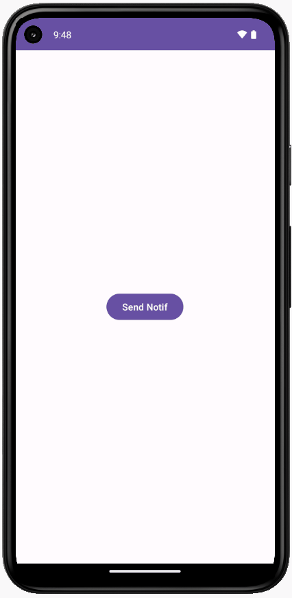

# Task & Back Stack with TaskStackBuilder (Notification App)

Learn how to implement Task & Back Stack with TaskStackBuilder, PendingIntent:

| Nama Project                  | SimpleNotif                    |
|-------------------------------|--------------------------------|
| Target & Minimum Target SDK   | Phone and Tablet, API level 21 |
| Tipe Activity                 | Empty Views Activity           | 
| Activity Name                 | MainActivity                   |
| Language                      | Kotlin                         |
| Build Configuration Language  | Kotlin DSL                     |

