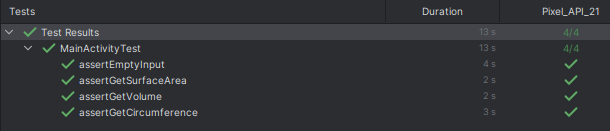

# Unit & UI Testing

Learn how to implement unit testing and UI testing using JUnit, Mockito and Espresso.

| Nama Project                  | My Testing App                 |
|-------------------------------|--------------------------------|
| Target & Minimum Target SDK   | Phone and Tablet, API level 21 |
| Tipe Activity                 | Empty Views Activity           |
| Activity Name                 | MainActivity                   |
| Language                      | Kotlin                         |
| Build Configuration Language  | Kotlin DSL                     |

