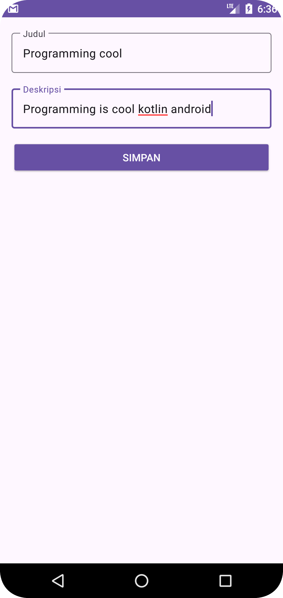

# Asynchronous Process with Background Thread

Learn about Background Thread. Simulation Asynchronous Process

| Nama Project                  | MyBackgroundThread             |
|-------------------------------|--------------------------------|
| Target & Minimum Target SDK   | Phone and Tablet, API level 21 |
| Tipe Activity                 | Empty Views Activity           | 
| Activity Name                 | MainActivity                   |
| Language                      | Kotlin                         |
| Build Configuration Language  | Kotlin DSL                     |

