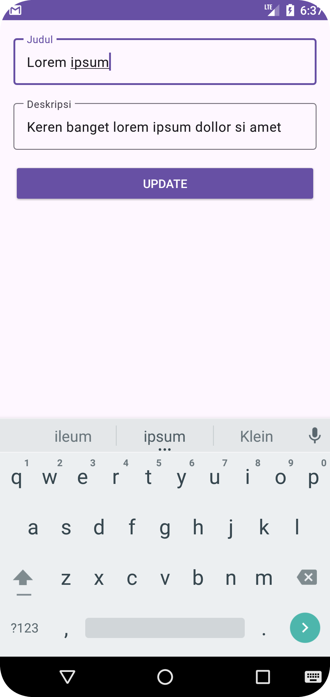

# Fundamental Android

Learn about Navigation specially Option Menu in AppBar, implement search bar and search view.

| Nama Project                  | MyAppBar                       |
|-------------------------------|--------------------------------|
| Target & Minimum Target SDK   | Phone and Tablet, API level 24 |
| Tipe Activity                 | Empty Views Activity           |
| Activity Name                 | MainActivity                   |
| Language                      | Kotlin                         |
| Build Configuration Language  | Kotlin DSL                     |

